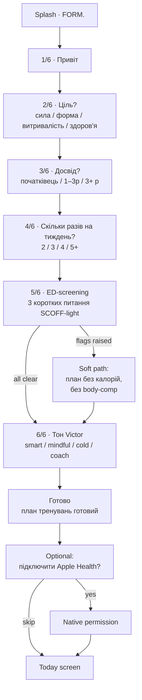
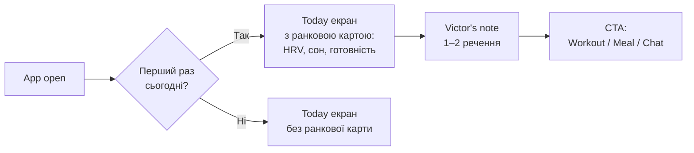
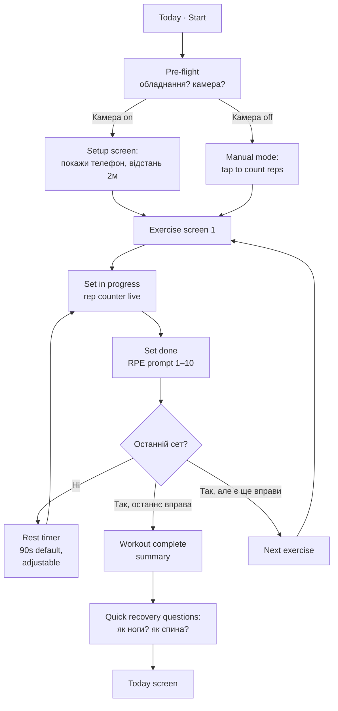
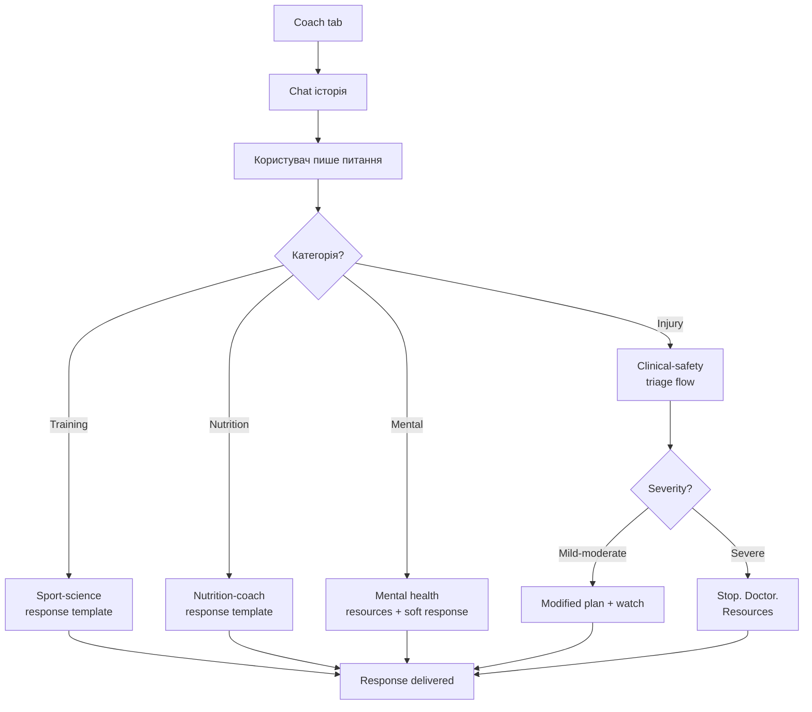

# FORM · User Flows v0.1

Власник: `ux-flow`. Правки через PR.

---

## 1 · Карта продукту

```
Tab Bar (5 max)
├─ Today        (default landing)
├─ Workout      (active program)
├─ Meals        (nutrition log)
├─ Coach        (chat with Victor)
└─ Progress     (90-day view)

Не в Tab Bar:
- Settings  — через профіль у Today (top-right avatar)
- Notifications history — через swipe down on Today
```

---

## 2 · First-Run · Onboarding

**Goal:** за ≤ 2 хвилини користувач має:
1. Перший план тренування на тиждень
2. Базові цілі (макроси)
3. Опитування на тон Victor
4. Опціонально: HealthKit / Health Connect підключений

**Жорсткі правила:**
- Жодних запитів про дозволи, які не потрібні **зараз**
- ED-скринінг — non-skippable перед будь-яким макро-плануванням
- За замовчуванням тон = `smart-direct`, не «жорсткий»

### 2.1 Happy Path



### 2.2 Edge cases

| Випадок | Що робимо |
|---|---|
| ED-flag raised | Soft mode — без калорій, без вагового трекінгу, ресурси самодопомоги в Settings |
| Користувач < 18 | Стоп. Лендинг з повідомленням «FORM — для дорослих». Жодного коучингу. |
| Користувач 65+ | PAR-Q (6 коротких питань про серцеві, тиск, ліки). За потреби — фліп на «consult MD first». |
| Денайт permission на HealthKit | Працюємо без даних. Manual workouts. Reminder через 14 днів. |
| Денайт notifications | Працюємо. У Settings — кнопка «увімкнути». |

### 2.3 Метрики

- Час до завершення (target < 120 сек, P95)
- Drop-off на кожному кроці (target < 15% на кожному, < 35% total)
- ED-flag rate (відстежуємо просто щоб знати масштаб, не для маркетингу)

---

## 3 · Daily Ritual

**Trigger:** перший вхід у застосунок за день.



### 3.1 Що показує Today

В порядку зверху вниз:
1. **Привітання + дата** (короткі, без «доброго ранку» якщо вже не ранок)
2. **Readiness ring** — тільки після 14 днів baseline. До цього — просто HRV число.
3. **Сьогоднішнє тренування** — велика картка, CTA «Старт».
4. **Калорії / макроси** — БЕЗ цифри «z'їли», тільки «лишилось», БЕЗ surveillance.
5. **Victor's note** — 1–2 речення з даних дня.

### 3.2 Edge cases

| Випадок | Поведінка |
|---|---|
| Перші 14 днів | Readiness ring приховано. Замість — «збираємо baseline · день N/14». |
| Немає wearable | Готовність прихована. Запитуємо суб'єктивно: «як спалося? як настрій?» — раз на день. |
| Day off (rest day) | Workout card → «Сьогодні відпочинок. Прогулянка 30 хв — добре б». |

---

## 4 · Workout · Active Session

**Goal:** провести користувача через сесію, лічити повторення, ловити деградацію техніки, тримати темп відпочинку.



### 4.1 Real-time coaching cues (camera mode)

Тригериться по таких подіях:
- Кут спини виходить за поріг → cue: «Спина рівна»
- Темп прискорюється → cue: «Повільніше на негативі»
- Глибина присіду занадто мала → cue: «Нижче»
- Trembling на останніх повтореннях → cue: «Ще 1 і кінець»

**Cue rules:**
- ≤ 4 слова
- ≤ 1 cue на 5 секунд (не спам)
- Голос або текст — на вибір користувача
- Цитата `brand-voice`: жодного «Just do it» чи «You got this»

### 4.2 Edge cases

| Випадок | Поведінка |
|---|---|
| Камера втратила позу > 5 сек | «Не бачу тебе. Поправ телефон.» Pause counter. |
| Користувач зупинився > 30 сек у середині сету | «Ще йдеш?» Опція skip-set. |
| Біль (натиснув кнопку «pain») | СТОП. Питання: де? коли? наскільки 1–10? Шкала ≥ 7 → «Stop now. See a doctor.» |
| Battery < 15% | Попередження. Можна продовжити без камери. |

### 4.3 Метрики

- Session completion rate (target ≥ 75%)
- Avg cues per session (sanity check, не KPI)
- Drop-off mid-session (target < 10%)

---

## 5 · Meals · Nutrition

**Goal:** залогувати їжу без шейму, з мінімальним friction.

```mermaid
flowchart LR
    A[Meals tab] --> B[Today's plan<br/>4 прийоми]
    B --> C{Метод запису?}
    C -->|Фото| D[Camera → CV recognition]
    C -->|Голос| E[Voice → parse]
    C -->|Manual| F[Search food DB]
    C -->|Skip| G[Marked as "not logged"<br/>без negative framing]
    D --> H[Підтвердження порції]
    E --> H
    F --> H
    H --> I[Logged]
```

### 5.1 Anti-shame правила

- Якщо користувач не залогував — **ніяких напоминалок типу «ти забув обід»**. Раз на день м'яко: «Залогіруй що було сьогодні — це допомагає плану».
- «Над лімітом калорій» — не показувати як червоне попередження. Показувати число, без негатив-фрейму.
- Жодних compensatory механік («-200 завтра», «+30 хв кардіо»).

### 5.2 Edge cases

| Випадок | Поведінка |
|---|---|
| Користувач постійно під лімітом > 3 днів поспіль | Soft alert (in-app, не push): «Інтейк низький останні дні. Усе окей?» Опція написати Victor. |
| Користувач пропустив 2+ прийоми | Нічого не питати. Залогувати «not tracked», йти далі. |
| Користувач кілька разів натиснув «replace meal» | Запропонувати загальне коригування плану — без шейму. |

---

## 6 · Coach · Chat

**Goal:** дати користувачу прямий канал до Victor для питань, які план не закриває.



### 6.1 Категорії і routing

Кожне повідомлення класифікується (Claude Haiku, fast):
- Training / progression
- Nutrition
- Injury / pain
- Mental health / motivation
- Tech / how-to
- Other

### 6.2 Hard rules

- **Будь-яка згадка про біль** — обов'язково проходить через clinical-safety шаблон. Не звичайна LLM-відповідь.
- **Будь-яке self-harm reference** — спливає resources + soft response, без «давай поговоримо про що інше».
- **Користувач хоче скасувати підписку через чат** — proxima до cancel flow, не «давай я тебе переконаю».

### 6.3 Edge cases

| Випадок | Поведінка |
|---|---|
| Користувач питає що зрозуміло запитує медичну пораду | «Я не лікар. Базовий triage можу дати. За симптомами Z — до лікаря.» |
| Користувач злий («ти лажа», «не працює») | Acknowledge, ask for specific. Не defensive. |
| Користувач хоче персональну людську консультацію | Premium tier: 1 human trainer call/month. Записуємо. |

---

## 7 · Progress · Long-term View

**Goal:** показати реальний прогрес без vanity metrics.

### Що в Progress

1. **Strength index** — composite з основних PR
2. **Weight trend** — sparkline 90 днів, без BMI, без % body fat (manual entry only якщо користувач хоче)
3. **PRs** — присід, жим, тяга, плюс aerobic (5К, мах) якщо є дані
4. **Consistency** — серія днів, але **з grace** (1 пропуск/тиждень дозволений)
5. **Weekly review** — кожен понеділок Victor пише підсумок (текст 60–80 слів)

### Хард-правила

- **Жодного reveal через "graphic" — без before/after фото**
- Streak ламається ТІЛЬКИ після 2+ пропусків. Один — окей.
- Body comp metrics — opt-in повністю, можна сховати назавжди.

---

## 8 · Settings & Privacy

### Структура

```
Settings
├─ Профіль
│  ├─ Ім'я, вік, стать, зріст, вага (опціонально)
│  └─ Цілі — переключити будь-коли
├─ Тон Victor
│  ├─ Persona (4 + custom)
│  └─ Slider: інтенсивність (м'яко ←→ прямо)
├─ Нотифікації
│  ├─ Кількість на день (макс 4, default 2)
│  ├─ Quiet hours (default 22:00–07:00)
│  └─ Категорії (workout reminder, recovery note, weekly review)
├─ Інтеграції
│  ├─ Apple Health / Health Connect
│  ├─ Whoop / Oura / Garmin (через partnership)
│  └─ Calendar (для авто-розкладу)
├─ Приватність
│  ├─ Експорт усіх даних (одна кнопка)
│  ├─ Видалити акаунт (3-step, без obstruction)
│  └─ Камера: де зберігається відео (ніде — пояснення)
├─ Підписка
│  ├─ Поточний статус
│  ├─ Cancel (без friction, без "пропозиції зачекайте")
│  └─ Manage billing
├─ Help & Support
└─ About
```

### Hard rules

- Cancel subscription = ≤ 3 кліки, жодних персуазій
- Delete account = повне видалення за 30 днів (GDPR), не soft-delete
- Export = повний JSON всіх даних, не обрізаний

---

## 9 · Push Notifications · Cadence

**Hard limits:**
- Максимум **2 нотифікації / день** за замовчуванням
- Жодних після 22:00 і до 07:00 (quiet hours, налаштовується)
- Жодних повідомлень про їжу в реальному часі
- Жодних streak-shame повідомлень

### Categories і timing

| Категорія | Час | Контент |
|---|---|---|
| Morning check-in | 07:00–08:30 (smart, по wake) | HRV + готовність + сьогоднішня сесія |
| Pre-workout reminder | 30 хв до запланованого workout | Коротко: «35 хв. Спина сьогодні.» |
| Recovery cue | 21:00–22:00 (тільки якщо є сигнал) | «Лягай о 23:00 — у п'ятницю присід.» |
| Weekly review | Пн ~09:00 | Зведення тижня, 60–80 слів |

### Anti-spam

- Якщо користувач ігнорує 3+ нотифікації поспіль → зменшити частоту автоматично
- Якщо користувач не залогує тренування 7+ днів → одна re-engagement (не більше)
- Жодних "ми скучили за тобою" / "ти давно з нами не був"

---

## 10 · Cancel & Churn Flow

Найважливіший флоу. Тут продукт показує характер.

```mermaid
flowchart TD
    A[Settings → Subscription → Cancel] --> B[Чесний екран:<br/>"Окей. Чому йдеш?"<br/>5 опцій + free text]
    B --> C{Reason?}
    C -->|Too expensive| D[Один офер: -40% на 3 міс<br/>Один. Не наполягати.]
    C -->|Not using| E[Pause for 30/60 days?<br/>Опція. Не наполягати.]
    C -->|Doesn't work| F[Що саме?<br/>Free text → CS]
    C -->|Other| G[Free text]
    C -->|Just done| H[Cancel direct]
    D -->|No| I[Cancel confirmed]
    D -->|Yes| J[Pricing changed,<br/>стан збережено]
    E -->|No| I
    E -->|Yes| K[Paused]
    F --> I
    G --> I
    I --> L[Goodbye screen:<br/>дані експортувати?]
    L --> M[Account deactivated<br/>30 day grace]
```

**Hard rules:**
- Cancel button завжди ≤ 3 tap від profile
- Один retention offer максимум. Якщо «ні» — приймаємо.
- Жодних «ти втратиш…», жодних guilt trips
- Goodbye screen — щира подяка, експорт даних, не «приходь ще»

---

**v0.1 · травень 2026 · правки приймає `ux-flow`, рев'юіт `clinical-safety`**
